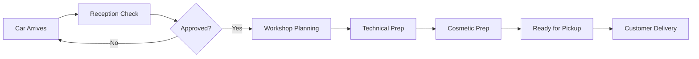

# DirectApp 🚗

**Car Dealership Management System for Norwegian Market**

DirectApp is a production-ready Directus fork designed specifically for Norwegian car dealerships to manage vehicle preparation workflows, from arrival to customer delivery.

[](https://directus.io)
[](./license)
[](./DOKPLOY_DEPLOYMENT_GUIDE.md)

---

## ✨ Features

### Current Features
- **Multi-dealership support** - Manage multiple locations with data isolation
- **Role-based workflows** - Sales, reception, mechanics, workshop planners
- **Vehicle tracking** - From arrival through preparation to delivery
- **Service management** - Track technical/cosmetic prep, parts, services
- **File management** - Photos, documents per vehicle
- **Norwegian localization** - UI in Norwegian (Bokmål)

### Planned Features (See [Roadmap](.claude/PRODUCTION_ROADMAP.md))
- **Vehicle data lookup** - Auto-populate from Statens Vegvesen API
- **Smart notifications** - Email + in-app via Resend
- **Scheduling system** - Resource management for workshop prep
- **Prep center workflows** - Cross-dealership vehicle transfers
- **AI integration** - MCP server for smart features

---

## 🚀 Quick Start

### Deploy with Dokploy (Recommended)

**Prerequisites:** Dokploy instance running

```bash
# 1. Clone repository
git clone https://github.com/gumpen-app/directapp.git
cd directapp

# 2. Configure environment
cp .env.dokploy.example .env
# Edit .env with your values

# 3. Deploy via Dokploy UI
# - Create new service (Docker Compose)
# - Upload docker-compose.dokploy.yml
# - Add environment variables
# - Deploy!

# 4. Access admin panel
https://your-domain.com/admin
```

**Detailed guide:** [DOKPLOY_DEPLOYMENT_GUIDE.md](./DOKPLOY_DEPLOYMENT_GUIDE.md)

---

## 📋 Documentation

### For Deployment
- **[Dokploy Deployment Guide](./DOKPLOY_DEPLOYMENT_GUIDE.md)** - Complete deployment instructions
- **[Environment Variables](./.env.dokploy.example)** - Configuration options

### For Development
- **[Production Roadmap](./.claude/PRODUCTION_ROADMAP.md)** - 8-phase development plan (12 weeks)
- **[Schema Analysis](./.claude/SCHEMA_ANALYSIS.md)** - Current system architecture & issues
- **[GitHub Issues Template](./.claude/GITHUB_ISSUES_TEMPLATE.md)** - Ready-to-use issues for fixes

### For Project Management
- **[Workflow System Setup](./.claude/PROJECT_SETUP.md)** - Using the .claude/ workflow
- **GitHub Project:** https://github.com/orgs/gumpen-app/projects/1

---

## 🏗️ Architecture

```
┌─────────────────────────────────────────────┐
│           DirectApp (Directus 11)           │
│                                             │
│  ┌─────────────────────────────────────┐   │
│  │ Collections                          │   │
│  │ - cars (main workflow)               │   │
│  │ - dealership (multi-tenant)          │   │
│  │ - cars_files (documents/photos)      │   │
│  └─────────────────────────────────────┘   │
│                                             │
│  ┌─────────────────────────────────────┐   │
│  │ Roles & Permissions                  │   │
│  │ - Nybilselger (new car sales)        │   │
│  │ - Bruktbilselger (used car sales)    │   │
│  │ - Mottakskontroll (reception)        │   │
│  │ - Klargjoring (mechanics)            │   │
│  │ - Booking (workshop planners)        │   │
│  └─────────────────────────────────────┘   │
│                                             │
│  ┌─────────────────────────────────────┐   │
│  │ Future: API Integrations             │   │
│  │ - Statens Vegvesen (vehicle data)    │   │
│  │ - Resend (email notifications)       │   │
│  │ - MCP Server (AI features)           │   │
│  └─────────────────────────────────────┘   │
└─────────────────────────────────────────────┘
           │              │
           │              │
      PostgreSQL       Redis
      (with PostGIS)   (cache)
```

---

## 🛤️ Workflow



### Status Flow
1. **Ubehandlet** (Untreated) - Just arrived
2. **Klar for planlegging** (Ready for planning) - Passed inspection
3. **Planlagt** (Planned) - Workshop scheduled
4. **Behandles** (Being processed) - In progress
5. **Ferdig** (Finished) - Ready for customer

---

## ⚠️ Current Issues

**The current system has 15 critical security & data integrity issues.**

Before production use, you MUST complete **Phase 0** of the roadmap:

### Critical Fixes Required
- [ ] Add unique constraints (VIN, order_number)
- [ ] Fix foreign key cascades
- [ ] Implement dealership data isolation
- [ ] Remove dangerous DELETE permissions
- [ ] Add VIN/license plate validation
- [ ] Fix user password update permissions
- [ ] Add audit logging

**See:** [Schema Analysis](./.claude/SCHEMA_ANALYSIS.md) for details

**Timeline:** 1-2 weeks (32 hours)

---

## 🗺️ Roadmap

### Phase 0: Critical Foundation (Week 1-2) 🔴 REQUIRED
Security fixes, database integrity, multi-tenant isolation

### Phase 1: Vehicle Data Integration (Week 3-4)
Statens Vegvesen API, auto-populate vehicle data

### Phase 2: Role-Optimized Workflow (Week 4-5)
Per-role dashboards and field visibility

### Phase 3: Notification System (Week 5-6)
Resend email + in-app notifications

### Phase 4: Multi-Dealership (Week 6-7)
Prep center model, cross-dealership transfers

### Phase 5: Scheduling (Week 7-9)
Resource management, booking system

### Phase 6: MCP Integration (Week 9-10)
AI assistant, smart features

### Phase 7: Production Deploy (Week 10-11)
Monitoring, backups, hardening

### Phase 8: Documentation (Week 11-12)
User training, admin guides

**Full details:** [Production Roadmap](./.claude/PRODUCTION_ROADMAP.md)

---

## 🔧 Development

### Using the Workflow System

This repo includes a complete workflow system in `.claude/`:

```bash
# Start working on a task
/work

# Check project status
/status

# Finish task and create PR
/done

# Sync with GitHub Project
/sync
```

**Learn more:** [Project Setup](./.claude/PROJECT_SETUP.md)

### Local Development

```bash
# Clone repo
git clone https://github.com/gumpen-app/directapp.git
cd directapp

# Install Directus
cd directus
pnpm install

# Set up environment
cp .env.example .env
# Edit .env

# Run database migrations
pnpm run directus bootstrap

# Start dev server
pnpm run dev

# Access at http://localhost:8055
```

### Creating Issues

We have 20+ pre-written issues ready to add to GitHub Project:

**See:** [GitHub Issues Template](./.claude/GITHUB_ISSUES_TEMPLATE.md)

---

## 🤝 Contributing

### Before You Start

1. Review [Schema Analysis](./.claude/SCHEMA_ANALYSIS.md)
2. Read [Production Roadmap](./.claude/PRODUCTION_ROADMAP.md)
3. Check [existing issues](https://github.com/gumpen-app/directapp/issues)

### Development Process

1. Create feature branch: `git checkout -b feature/your-feature`
2. Make changes
3. Test thoroughly
4. Run `/check` (validation)
5. Commit with `/done` (creates PR)

### Code Style

- Follow existing Directus conventions
- Write Norwegian UI strings
- Add tests for new features
- Document breaking changes

---

## 📊 Tech Stack

**Core:**
- [Directus 11](https://directus.io) - Headless CMS
- [PostgreSQL 15](https://www.postgresql.org) + [PostGIS](https://postgis.net) - Database
- [Redis 7](https://redis.io) - Cache
- [Vue 3](https://vuejs.org) - Admin UI

**Deployment:**
- [Docker](https://www.docker.com) - Containerization
- [Dokploy](https://dokploy.com) - Self-hosted PaaS
- [Traefik](https://traefik.io) - Reverse proxy
- [Let's Encrypt](https://letsencrypt.org) - SSL certificates

**Planned Integrations:**
- [Statens Vegvesen API](https://www.vegvesen.no) - Vehicle data
- [Resend](https://resend.com) - Email notifications
- [Sentry](https://sentry.io) - Error monitoring
- [Directus MCP Server](https://github.com/directus/mcp) - AI features

---

## 📝 License

**Business Source License (BSL) 1.1** - See [license](./license)

### Summary

- **Free for organizations with <$5M revenue/funding**
- Commercial license required for larger organizations
- Keeps Directus free for individuals and startups
- Ensures sustainable development

**Full details:** [Understanding Our License](./directus/readme.md#-understanding-our-license)

---

## 🔗 Links

- **Live Demo:** TBD
- **GitHub Project:** https://github.com/orgs/gumpen-app/projects/1
- **Directus Docs:** https://docs.directus.io
- **Dokploy Docs:** https://docs.dokploy.com
- **Issues:** https://github.com/gumpen-app/directapp/issues

---

## 📞 Support

### For DirectApp

- Create issue: [GitHub Issues](https://github.com/gumpen-app/directapp/issues)
- Check docs: `.claude/` directory
- Review roadmap: [PRODUCTION_ROADMAP.md](./.claude/PRODUCTION_ROADMAP.md)

### For Directus

- Docs: https://docs.directus.io
- Discord: https://directus.chat
- Community: https://community.directus.io

### For Dokploy

- Docs: https://docs.dokploy.com
- GitHub: https://github.com/Dokploy/dokploy
- Issues: https://github.com/Dokploy/dokploy/issues

---

## 🎯 Project Status

**Development Status:** ⚠️ In Development - Not Production Ready

**Current Phase:** Phase 0 - Critical Foundation

**Production Readiness:**
- Database: 🔴 Critical issues (15 found)
- Security: 🔴 Multi-tenancy not enforced
- Features: 🟡 Basic workflow implemented
- Documentation: 🟢 Complete
- Deployment: 🟢 Dokploy ready

**Estimated to Production:** 2-3 weeks (Phase 0 completion)

---

## 🙏 Acknowledgments

- **[Directus](https://directus.io)** - Amazing headless CMS platform
- **[Dokploy](https://dokploy.com)** - Self-hosted deployment made easy
- **Statens Vegvesen** - Open vehicle data API
- Norwegian car dealerships for requirements and testing

---

**Built with ❤️ for Norwegian car dealerships**

**Questions?** Check the [deployment guide](./DOKPLOY_DEPLOYMENT_GUIDE.md) or [create an issue](https://github.com/gumpen-app/directapp/issues)!
