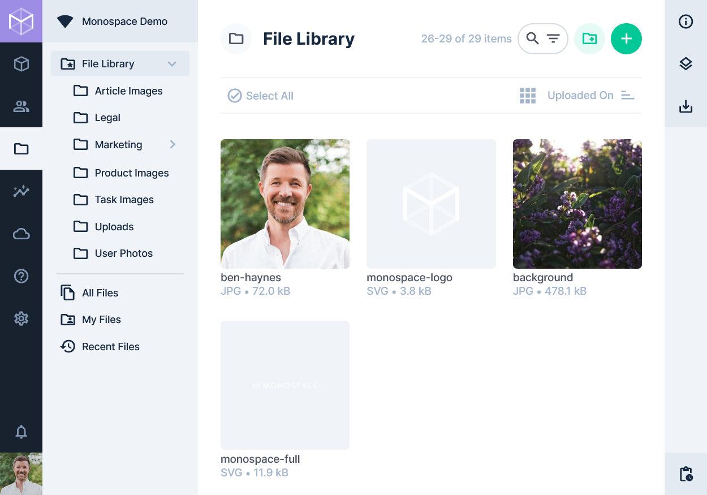
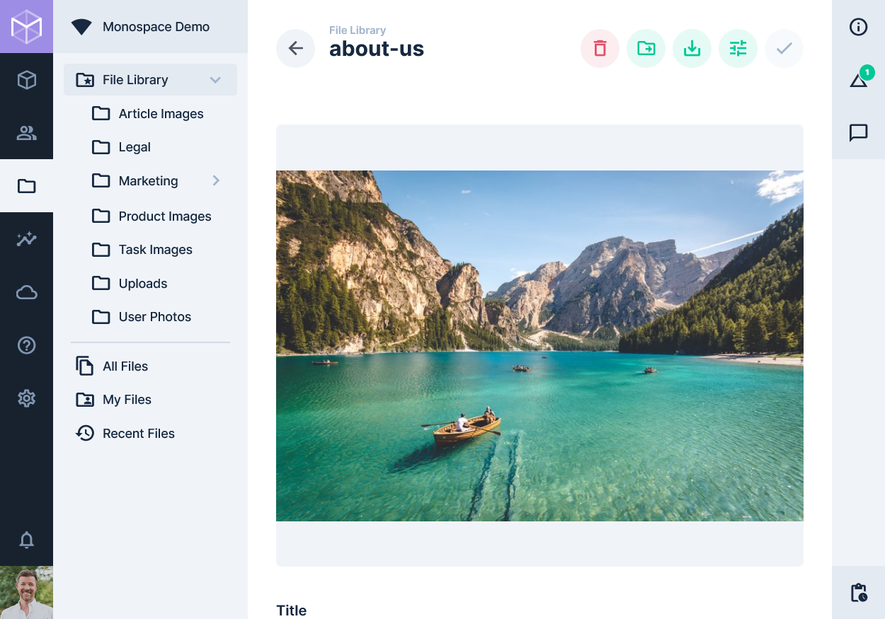

# File Library

> Directus includes a full-featured Digital Asset Management (DAM) system for storing, organizing, browsing, and
> transforming your various files and assets.

[[toc]]

## Browsing Files

This module aggregates all files within the project into one consolidated library. This listing page has the same
features and functionality as the [Collection Page](/app/content-collections/).

## Viewing or Editing a File

Provides a custom form for viewing assets and embeds, with core fields included out-of-the-box (see below), and the
ability for administrators to add additional custom fields. This page has the same features and functionality as the
[Item Page](/getting-started/glossary/#items).

#### File Info

- **Preview** — A preview of the image or file
- **Title** — A title for the file
- **Description** — A description of the file
- **Tags** — Keywords used for searchability
- **Location** — An optional location, eg: where a photo was taken
- **Storage** — Which storage adapter is used to store the file asset
- **Filename (Disk)** — LOCKED, this is the actual name of the file in storage
- **Filename (Download)** — This allows you to set the name of the file when it is downloaded

The file sidebar also includes the following details:

- **Type** — The MIME type of the file, displayed in the App as a formatted media type
- **Dimensions** — (Images Only) The width and height of the image in pixels
- **Size** — The file-size the asset takes up within the storage adapter
- **Created** — The timestamp of when the file was uploaded to the project
- **Owner** — The Directus user that uploaded the file to the project
- **Modified** - The timestamp of when the file was last modified
- **Edited By** — The Directus user that modified the file
- **Folder** — The current parent folder that contains the file
- **Metadata** — Metadata JSON dump of the file's EXIF, IPTC, and ICC information

#### Action Buttons

- check — Saves any edits made to the file
- tune — Refer [Editing an Image](#editing-an-image)
- save_alt — Downloads the file to your current device
- 
  — Move the file to another folder
- delete — Permanently removes the file and its metadata. This action is permanent and can not
  be undone.

## Editing an Image

Clicking the tune action button on the File Detail opens an image editor for rotating, cropping,
or mirroring the file.

1. From the **File Library**, click a file to open it's detail page
2. Click the tune button in the top right to open the image editor

<video alt="Image Editing" loop muted controls autoplay>
  <source src="https://cdn.directus.io/docs/v9/app-guide/file-library/image-editing-220129A.mp4" type="video/mp4">
</video>

3. Make your changes and hit check in the top right to save the updates to the file.

## Replacing a File

Clicking the image Preview on the File Detail page opens a modal where you can replace the file. This is useful if you
want to change the file, but keep existing file info and maintain all of the file's relationships.

<video alt="Replacing a File" loop muted controls autoplay>
  <source src="https://cdn.directus.io/docs/v9/app-guide/file-library/replace-file-220129A.mp4" type="video/mp4">
</video>

## Uploading a File

There are many ways that a file can be uploaded into Directus via the App. We'll cover the primary method below, but
keep in mind that files can also be added directly through different interfaces.

<video alt="Uploading a File" loop muted controls autoplay>
  <source src="https://cdn.directus.io/docs/v9/app-guide/file-library/upload-file-220129A.mp4" type="video/mp4">
</video>

1. From the **File Library**, click on the add button located in the header
2. **Upload** the file by:
   - Dragging a file from your desktop to the modal
   - Click the modal area to manually select a file from your device
   - Clicking the more_vert icon and choosing "Import from URL"

## Creating a Folder

<video alt="Creating a Folder" loop muted controls autoplay>
  <source src="https://cdn.directus.io/docs/v9/app-guide/file-library/create-folder-220129A.mp4" type="video/mp4">
</video>

1. From the **File Library**, click on the create_new_folder button located in the header
2. Fill in the folder name
3. Click "Save"

## Renaming a Folder

<video alt="Renaming a Folder" loop muted controls autoplay>
  <source src="https://cdn.directus.io/docs/v9/app-guide/file-library/rename-folder-220129A.mp4" type="video/mp4">
</video>

1. From the **File Library**, right-click on the folder you wish to rename and select "Rename Folder"
2. Update the folder name
3. Click "Save"

## Moving a Folder

<video alt="Moving a Folder" loop muted controls autoplay>
  <source src="https://cdn.directus.io/docs/v9/app-guide/file-library/move-folder-220129A.mp4" type="video/mp4">
</video>

1. From the **File Library**, right-click on the folder you wish to move and select "Move to Folder"
2. Select a folder that will be the new parent folder
3. Click "Save"

## Deleting a Folder

<video alt="Deleting a Folder" loop muted controls autoplay>
  <source src="https://cdn.directus.io/docs/v9/app-guide/file-library/delete-folder-220129A.mp4" type="video/mp4">
</video>

1. From the **File Library**, right-click on the folder you wish to delete and select "Delete Folder"
2. Click "Delete"

::: tip

When you delete a folder, any nested files and folders will be moved one level up.

:::
