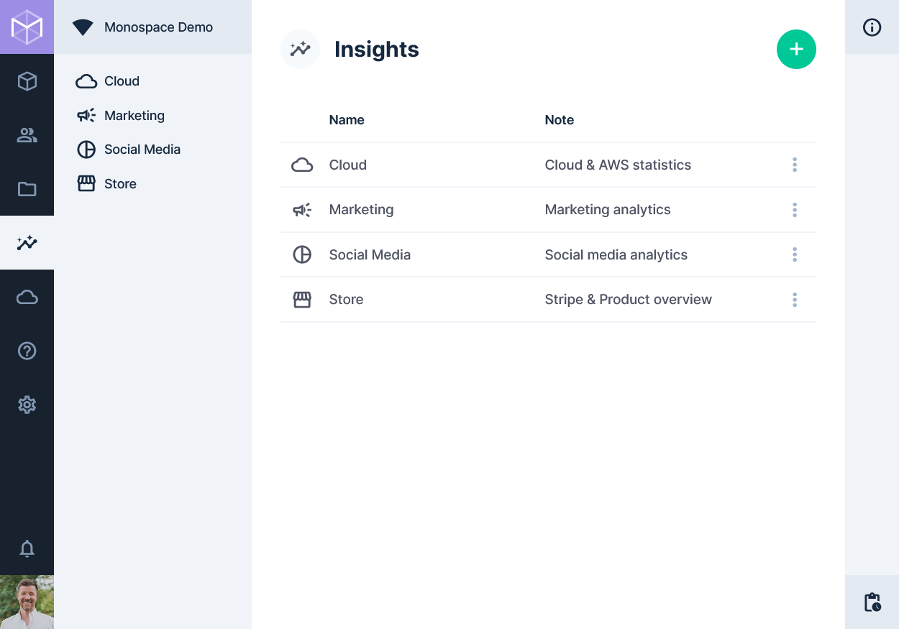

# Insights

> This [Module](/getting-started/glossary/#modules) allows the creation of custom
> [Dashboards](/getting-started/glossary/#dashboards), each with any number of highly configurable
> [Panels](/getting-started/glossary/#panels) for displaying data.

[[toc]]

## Browsing Dashboards

Clicking into the Insights module immediately presents a listing of all dashboards you have access to. These are shown
in the navigation bar and a listing on the main page.

## Creating a Dashboard

1. Click the add button in the header.
2. Fill in the dashboard name, icon and note
3. Click "Save"

## Editing a Dashboard

1. Click on the Insights module to go to the Dashboard listing
2. Click the more_vert for the dashboard you want to edit
3. Make any edits, and then click "Save"

::: tip Editing the Dashboard Panels

To edit the Panels within the dashboard, please see: [Editing a Panel](#editing-a-panel)

:::

## Deleting a Dashboard

1. Click on the Insights module to go to the Dashboard listing
2. Click the right-hand more_vert context menu for the dashboard you want to edit
3. Choose "Delete Dashboard" and click to confirm

## Creating a Panel

1. Click on the Insights module to go to the Dashboard listing
2. Click the desired dashboard to view it
3. Click edit in the header
4. Click add in the header
5. Choose a panel type and enter its options in the panel drawer
6. Click check in the drawer header
7. Drag the new panel to position it on the grid
8. Grab the sides or corners to resize the panel as needed
9. Click check in the page header

## Editing a Panel

1. Click on the Insights module to go to the Dashboard listing
2. Click the desired dashboard to view it
3. Click edit in the header
4. Hover over the desired panel, and click on edit
5. Make the desired changes in the panel drawer
6. Click check in the drawer header
7. Click check in the page header

::: tip Panel Size & Position

Drag the panel to a new position and/or grab the corners/sides to resize it as needed.

:::

## Duplicating a Panel

1. Click on the Insights module to go to the Dashboard listing
2. Click the desired dashboard to view it
3. Click edit in the header
4. Hover over the desired panel, click more_vert then "Duplicate"
5. Reposition and resize as needed
6. Click check in the page header

## Deleting a Panel

1. Click on the Insights module to go to the Dashboard listing
2. Click the desired dashboard to view it
3. Click edit in the header
4. Hover over the desired panel, click more_vert then "Delete Panel"
5. Click check in the page header
