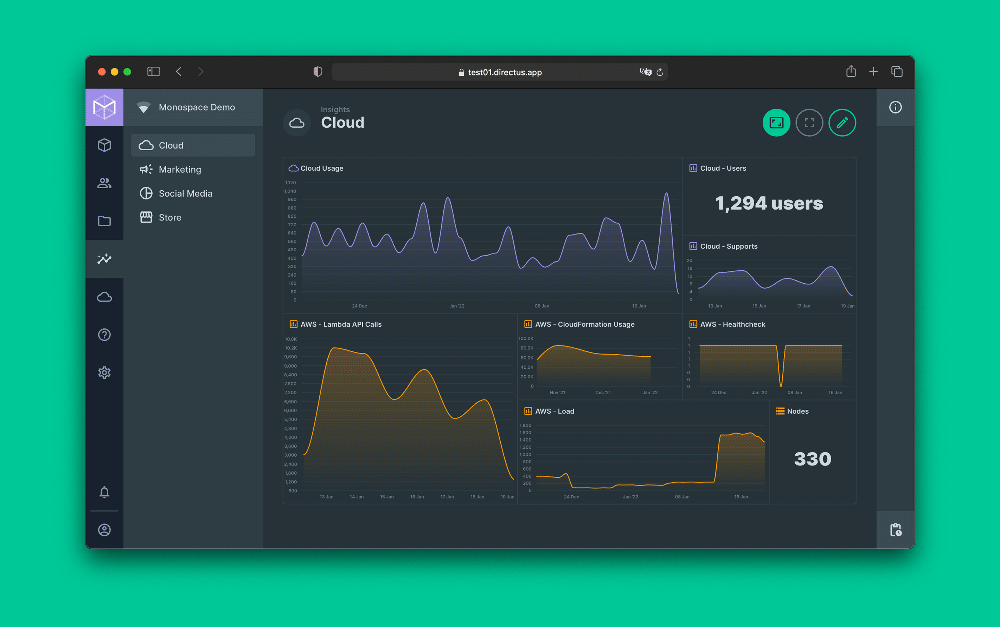
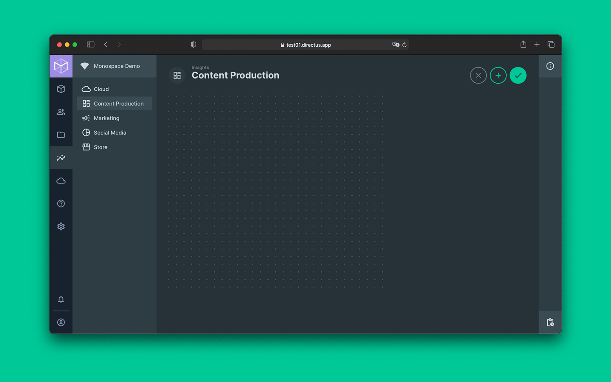
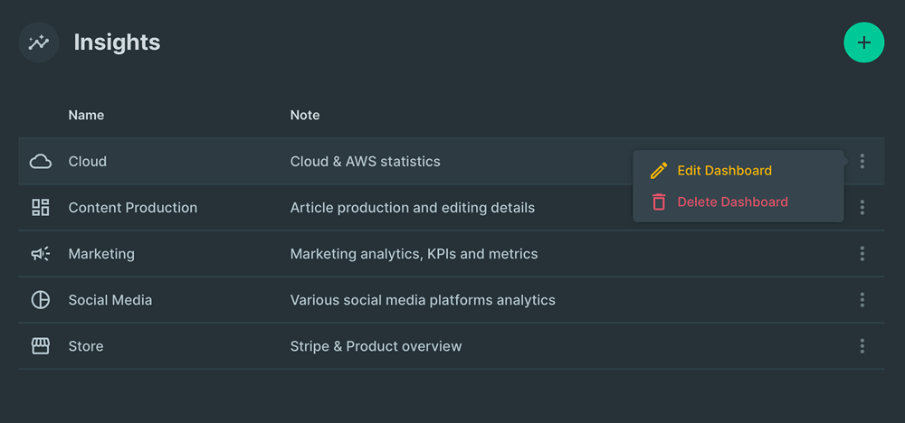
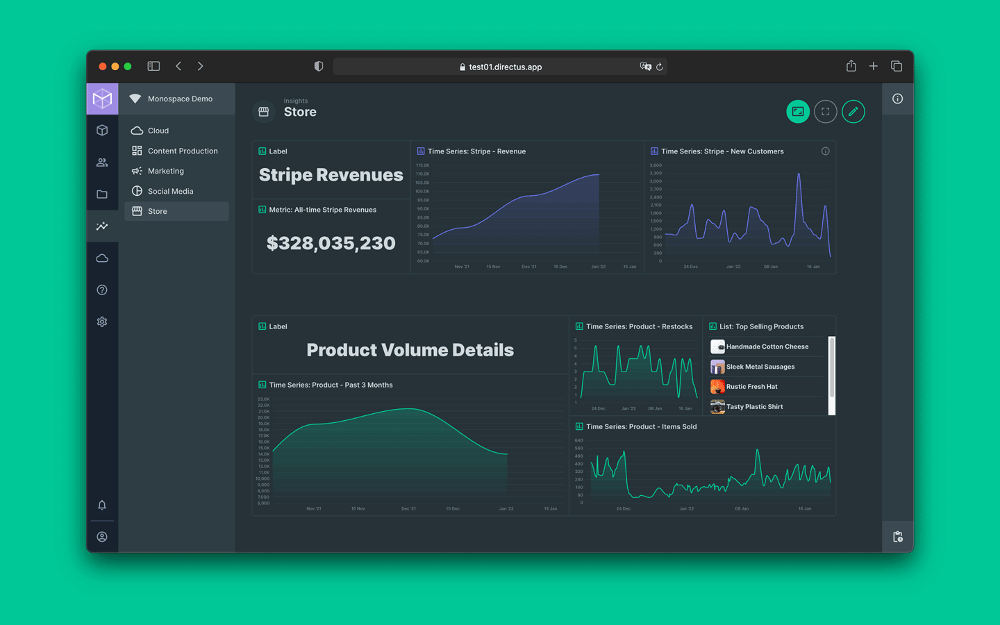
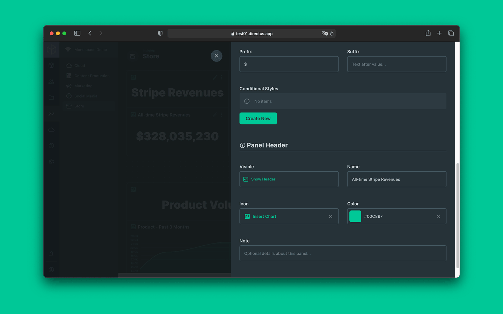
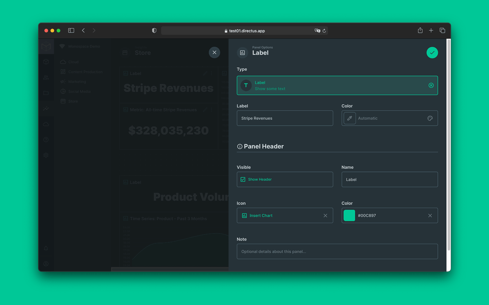
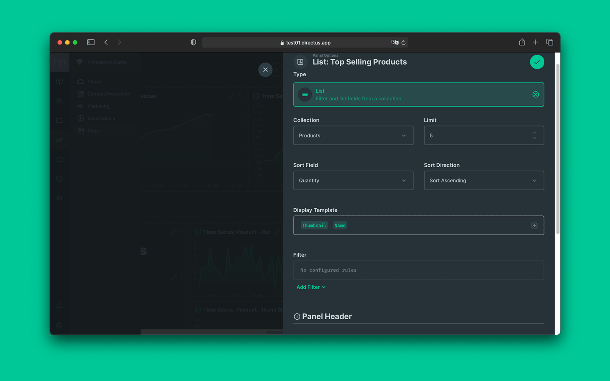

# Insights

> Insights is a module in Directus that allows rapid, no-code buildout of analytics dashboards. Regardless of your
> use-case (_be it business intelligence, user progress tracking, web traffic conversions, or whatever_!) you will be
> able to setup key data metrics in just a few clicks.

- [How it Works](#how-it-works)
- [Dashboards Overview](#dashboards-overview)
- [Panels Overview](#panels-overview)
  - [Panel Header Options](#panel-header-options)
  - [Label Overview](#label-overview)
  - [List Overview](#list-overview)
  - [Metrics Overview](#metrics-overview)
    - [Style and Format Options](#style-and-format-options)
  - [Time Series Overview](#time-series-overview)
  - [Advanced Filtering](#advanced-filtering)
- [Tutorial Video](#tutorial-video)
- [Extensibility Options](#extensibility-options)

## How it Works

1. Create a new dashboard by clicking the `+` icon in the upper right hand corner.
2. Name your dashboard and add a brief note to describe its purpose.
3. Click the edit icon in the upper right hand corner, then hit `+` to add a panel.
4. Select a panel type, then use Panel Options to setup metrics.

### Intro Video

This [Intro video](https://www.example.com) will give you a firm overview of the insights module.

## Dashboards Overview

A Directus dashboard provides a drag-and-drop, snappy-grid area where you create and edit panels, which provide
analytics information. The Dashboard area automatically expands as you add more and more panels. In theory, a dashboard
area can expand infinitely large... but in practice, users will probably only want to build dashboards as large as the
screen they will be viewing on. You are able to create as many dashboards as you need. Additionally, the Dashboard view,
edit, and create permissions can be turned on and off based on user role.

### Create, Edit, and Delete Dashboards

1. Click the `+` icon to create a new Dashboard.
2. Click the dashboard item options to delete or edit the Dashboard

## Panels Overview

Panels are the building-blocks we add onto Insights dashboards to create, save and display data analytics. There are 4
types of panels.

1. **Label** - Displays simple header text to describe other groups of panels. Doesn't actually provide data analysis.
2. **List** - Sortable, filterable list of items within a collection.
3. **Metric** - Sortable, filterable single-number metrics like sum, average, minimum and maximum, or first and last.
4. **Time Series** - Graph to display how metrics change over time. Provides same sorting, filtering and aggregation
   features seen in the list and metric panels.

### Panel Header Options

All 4 panel types let you set custom text to provide quick and clear context about what a panel represents. Panel Header
options are exactly the same for all four panel types. They are also totally optional and can be hidden.

- **Visible** - Determines if the header is visible or not
- **Name** - Sets a name in the header area
- **Icon** - Sets a small icon by the name
- **Color** - Sets a color for the icon
- **Note** - Sets a short description of the icon

### Label Overview

As the name implies, this panel simply allows you to _label_ a group of other panels. Labels do not provide analytics.
Labels simply help visually group the other panels (_which do provide analytics_) and give context to your dashboard.

#### Label Panel Options

- **Label** - Sets the label text
- **Color** - Sets the label text color

### List Overview

List panels display some number of items from a collection, _as a list!_ These items displayed can be filtered by other
criteria as well. So for example, you could show the site's top 5 selling products, 3 worst performing sales regions, 10
students with the highest GPA _that are also_ in intramural sports, or create any other kind of ranked list that your
dataset supports.

#### List Panel Options

- **Collection** - Selects the collection to rank
- **Limit** - Limits the number of items that will appear in the dashboard
- **Sort Field** - Sets the collection field you wish to order results by.
- **Sort Direction** - Sets items to display in ascending or descending order
- **Display Template** - Sets which fields will appear on-screen to represent list items
- **Filter** - Sets filters to only consider and rank items that meet some criteria

### Metrics Overview

Metrics panels allow you to aggregate numeric fields into a single number.

#### Metrics Panel Options

- **Collection** - Selects the collection
- **Field** - Selects the field to run aggregate function on
- **Aggregate Function** - Selects the type of aggregate to perform
- **Sort Field** - Sets the collection field you wish to order results by
- **Filter** - Sets filters to only only run metrics on items that meet some criteria

::: warning Must be numeric Non-numeric fields like text cannot be aggregated, so they become grayed out and
unselectable in the field dropdown list. :::

#### Style and Format Options

- **Abbreviate Value** - Abbreviates large numbers with a letter _(e.g. 2,000 = 2k)_
- **Decimals** - Changes the number of decimals displayed
- **Prefix** - Adds text before the metric
- **Suffix** - Adds text after the metric
- **Conditional Styles** - Changes color of number displayed if it is `>`, `>=`, `<`, `<=`, `==` (equal to), or `!=`
  (not equal to) to some defined value

### Time Series Overview

The Time Series panel allows you to build graphs and see how data changes over time.

::: tip Note In order to use this panel, your collection will need a datetime field. :::

- **Collection** - Selects the collection you want to analyze
- **Color** - Sets color of your graph curve
- **Group Aggregation** - Selects the type of aggregation to perform
- **Group Precision** - Sets the time interval to aggregate by _(days, weeks, months etc.)_
- **Date Field** - Selects the datetime field used along the x-axis.
- **Date Range** - Selects the time range from which data should be displayed
- **Value Field** - Sets the field you wish to aggregate
- **Value Decimals** - Changes the number of decimals displayed on the y-axis
- **Min Value** - Sets minimum value displayed on y-axis
- **Max Value** - Sets maximum value displayed on y-axis
- **Curve Type** - Sets curve to be shown as smooth, straight or stepline
- **Fill Type** - Sets fill type under curve to gradient, solid, or none
- **Filter** - Allows filtering of items considered for analysis based on logical conditions
- **Show X-axis** - Toggles display of time along X-axis
- **Show Y-axis** - Toggles display of numeric values along Y-axis

### Advanced Filtering

The filtering options are infinitely customizable. However, they will be limited by the collections, relations, and
information stored in your database.

#### Nested Filters

Sometimes, you will need to run filters that require information from two or more collections. Here might be a few
examples:

- Highest paid authors that wrote 5 or more books (uses `authors` and `books` collections)
- Products with less than 50 sales monthly (uses `products` and `orders` collections)
- Blog Posts with the highest number of social shares (uses `blog` and `social share metadata` collections )

Nested filters limit results of one collection by the values of fields from a related collection. Let's look at how to
create a nested filter:

1. Create a filter
2. Select a foreign key field
3. Create a new filter
4. Nest it under the first filter by clicking and dragging the lower filter to the right
5. Select the filters to apply on this collection

::: tip Foreign Key A _foreign key field_ is a field that references the primary key (often times this is the `ID`)
field of another collection. ::: ::: tip How to filter against other tables Once a foreign key is selected on a filter,
any directly nested filters will take on the other fields from that collection. :::

## Tutorial Video

Learn to make analytics dashboards with meaningful insights panels.

- Watch the tutorial -> [Watch the Tutorial](https://www.example.com)

## Extensibility Options

Teams that need highly advanced or specialized analytics options are able to extend, customize and modify this module as
needed. Here are some great resources to get started down that track:

- [Extensions > Modules]()
- [Extentions > Panels]()
