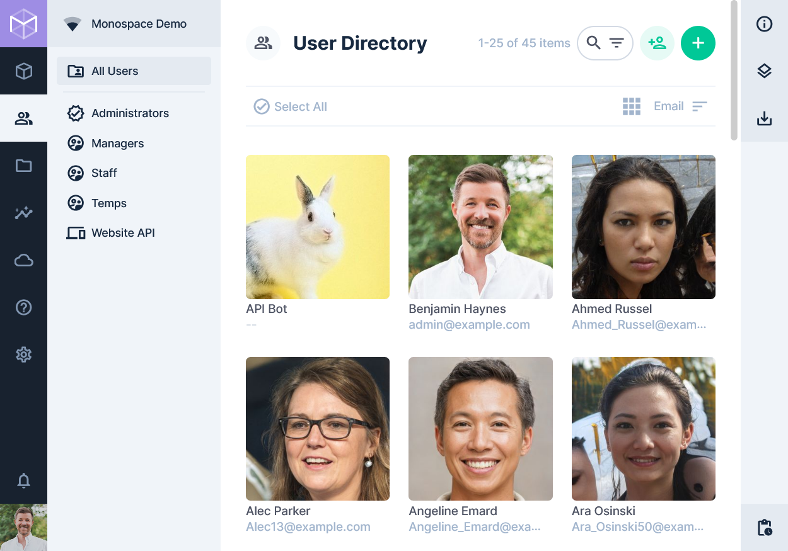

# User Directory

> The User Directory Module is an interface to manage all users within the project, each with their own customizable
> profile page.

[[toc]]

## How it Works

<video autoplay muted loop controls>
<source src="www.example.com/example.mp4" />

Your browser is not displaying the video for some reason. Here's a <a href="www.example.com/example.mp4">link to the video</a> instead.

</video>

1. Nav to User Directory
2. Create & Invite
3. Edit
4. Delete

## User Directory Overview

[Users](/getting-started/glossary#users) are the individual accounts for logging in to the App. Each user belongs to a
[Role](/getting-started/glossary#roles), which defines its [Permissions](/getting-started/glossary#permissions).
**Expand Paragraph**

Users are referenced throughout the app, often for accountability purposes. Hovering over a user in this context will
provide a popover for basic information, and clicking that popover will navigate you to a read-only view of that user's
profile page.

You can access your profile page from the User Directory or by clicking the User Menu in the
[Module Bar](/app/overview/#_1-module-bar). The profile page has the same features and functionality as the
[Item Page](/app/content-items/). Administrators can customize the fields on this page, but the following are available
by default.

::: tip System Fields

Administrators have access to additional system fields.

:::

- Navbar – Filter by Role.
- Header
  - Filter
  - Invite User
  - Create Item (aka a User)
  - Card Size
  - Filter
  - Sort By Asc/Desc

## Browsing Users

Lists all users of the project, with a navigation that allows quick access to the different role groups. This page has
the same functionality as other [Content Pages](/app/content-collections/).

## The User Page

Intro Paragraph.

### User Details

- **First Name** — The given name
- **Last Name** — The family/surname
- **Email** — A unique email address
- **Password** — A hashed system password
- **Avatar** — An image to represent the user
- **Location** — The city, country, office, or branch name
- **Title** — The professional staff title
- **Description** — A freeform text description
- **Tags** — Keywords for searchability

### User Preferences

- **Language** — The preferred App language/locale
- **Theme** — Light or Dark mode (or based on system preferences)
- **Multi-Factor Authentication** — Configuration for MFA
- **Email Notifications** - Receive emails for notifications

### Admin Options

- Status
- Role
- Token
- Provider
- External Identifier

### Readonly Info

The sidebar's info component also includes the following readonly details:

- **User Key** — The primary key of the user
- **Last Page** — The last App page accessed by the user
- **Last Access** — The timestamp of the user's last App or API action

## Editing / Deleting User(s)

### Edit Existing User

1. Navigate into **Share Options Menu > Role > open_in_new > Users In Role**.
2. Click "Add Existing".
3. Click on the User(s) you wish to add.
4. Click the check icon to confirm your selection.

### Editing / Deleting Multiple Users

1. Click
2. Edit/Delete

## Extensibility Options

Directus Core is completely open-source, modular and extensible. Extensions allow you to expand or modify any part of
Directus to fit your needs. Here are some great resources to get started down that track.

Extensions > Introduction Extensions > Creating Extensions Contributing > Introduction Contributing > Codebase Overview

::: tip Sponsoring Accelerated Development

Working on an enterprise project and looking to outsource or financially sponsor the development of a Shares extension?
Contact [our team](https://directus.io/contact/).

:::

## More Help

Looking for technical support for your non-enterprise project? Chat with thousands of engineers within our growing
[Community on Discord](https://discord.com/invite/directus).
