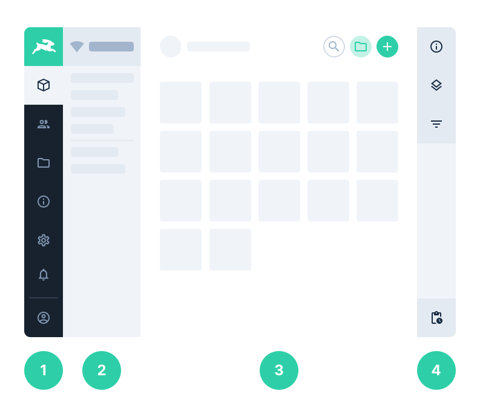

# The Directus Application

> The Directus App is the presentation layer for your data, content, and assets. It uses a left-to-right visual
> hierarchy for organization and navigation. Below we cover the App's global elements and individual pages.

The Directus App is decoupled from, and powered by, the Directus API. It provides a way for both technical admins and
non-technical users to view and manage content of the connected database. It is written in [Vue.js](https://vuejs.org),
is completely modular, and is highly customizable.

## App Section Hierarchy

### 1. Module Bar

- **Project Logo** — Displays your configured project logo and project color (defaults to the Directus logo and color).
  If configured, clicking this component will navigate to the Project URL. During platform activity, an indeterminate
  progress indicator will also be shown here.
- **Module Navigation** — Allows navigating between the different modules your user has access to. Customizing the
  Module Navigation is done within the [Role's configuration](/guides/roles/#configuring-a-role), but the default module
  list includes:
  - [Collections](#collections)
  - [User Directory](#user-directory)
  - [File Library](#file-library)
  - [Documentation](#documentation)
  - [Settings](#settings) (Admin Roles Only)
  - [Any Custom Modules](/concepts/modules/) (Only if Configured)
- **Current User Menu** — This component displays the authenticated user's name and avatar.
  - Sign Out — Hovering over the User Menu exposes the button to log out of the platform.

### 2. Navigation Bar

- **Project Name** — Shows an icon and tooltip indicating the API's connection strength, and the name of your current
  project, which can be configured under [Project Settings](/guides/projects/#adjusting-project-settings).
- **Navigation** — This is a dynamic navigation based on your current module. Some modules also support
  [Bookmark Presets](/guides/presets/#creating-a-preset), which are a customizable links to specific data-sets.

### 3. Page

- **Header** — A fixed section at the top of each page, the header includes:
  - Page Icon — Clicking this navigates back to the previous page.
  - Module Name — Clicking this navigates to the parent module/section.
  - Page Title — Displays dynamic title of the current page.
  - Action Buttons — Right-aligned contextual buttons for specific page actions.
- **Page Content** — This displays the content of the page you navigated to.

### 4. Page Sidebar

- **Page Components** — Lists any contextual page components available. The "Info" component is available on every page,
  explaining the page's general purpose and relevant details. Clicking any sidebar component will accordion it open. If
  the App window is large enough, the sidebar will automatically open, and can be closed by clicking the "X" in the
  top-right.
- **Notifications Tray** — Fixed to the bottom of the page sidebar, this button opens a tray of recent user
  notifications, and provides a link to the [Activity Log](#activity-log) page.

## Collections

This module is the primary way for interacting with your database content. Here you can access your collections, browse
their items, and navigate to individual item forms.

### Collection Listing

A page that lists the collections available to the current user. This is the landing page of the module, and effectively
the same as its navigation listing.

### Collection Detail

This is the main gateway to your content items, providing a highly configurable Layout for browsing and visualizing the
items within a collection. The header of this page includes key action buttons for creating, deleting, and batch editing
items.

- [Adjusting a Collection Layout](/guides/collections/#adjusting-a-collection-layout)
- [Creating an Item](/guides/items/#creating-an-item)
- [Updating an Item](/guides/items/#updating-an-item)
- [Deleting an Item](/guides/items/#deleting-an-item)
- [Archiving an Item](/guides/items/#archiving-an-item)
- [Ordering Items](/guides/items/#ordering-items)
- [Exporting Items](/guides/items/#exporting-items)
- Browsing Items
  - [Searching](/guides/items/#searching-items)
  - [Filtering](/guides/items/#filtering-items)
  - [Bookmarking](/guides/items/#bookmarking-item-presets)

### Item Detail

Most Collection Detail Layouts support navigating to individual item detail pages where you a presented with a
[customizable form](/guides/fields#adjusting-field-arrangement) for viewing/editing the item's content. Like other
detail pages, there are many available features, including:

- [Adjusting Field Arrangement](/guides/fields/#adjusting-field-arrangement)
- [Updating an Item](/guides/items/#updating-an-item)
- [Archiving an Item](/guides/items/#archiving-an-item)
- [Reverting an Item](/guides/items/#reverting-an-item)
- [Deleting an Item](/guides/items/#deleting-an-item)
- [Commenting on an Item](/guides/items/#commenting-on-an-item)

## User Directory

This module includes a comprehensive listing of all system users within your project. This page has the same features
and configuration as [Collection Detail](#collection-detail).

### User Detail

Similar to other [Item Detail](#item-detail) pages, this page provides a custom form for viewing system users. This is
also used for editing the "Profile Page" of the current user, which is accessible from the [User Menu](#_1-module-bar).
There are a number of [User Fields](/concepts/users/#user-fields) included out-of-the-box that can then be extended by
following the normal [Creating a Field](/guides/fields/#creating-a-field) guide.

- [Creating a User](/guides/users/#creating-a-user)
- [Inviting a User](/guides/users/#inviting-a-user)
- [Configuring a User](/guides/users/#configuring-a-user)
- [Archiving a User](/guides/users/#archiving-a-user)
- [Deleting a User](/guides/users/#deleting-a-user)

## File Library

This module aggregates all files within the project into one consolidated library. This page has the same features and
configuration as [Collection Detail](#collection-detail).

### File Detail

Similar to other [Item Detail](#item-detail) pages, this page provides a custom form for viewing assets and embeds.
There are a number of [File Fields](/concepts/files/#file-fields) included out-of-the-box that can then be extended by
following the normal [Creating a Field](/guides/fields/#creating-a-field) guide.

- [Uploading a File](/guides/files/#uploading-a-file)
- [Accessing an Original File](/guides/files/#downloading-an-original-file)
- [Creating a Thumbnail Preset](/guides/files/#creating-a-thumbnail-preset)
- [Requesting a Thumbnail](/guides/files/#requesting-a-thumbnail)

## Documentation

This module is an internal set of guides, concepts, and reference docs for your project's specific version of Directus.
It also includes a dynamic [API Reference](/reference/api/introduction) that is dynamically tailored to your custom
schema. The docs are organized into these distinct sections:

- [Getting Started](/getting-started/introduction/) — Novice oriented, for a platform intro and installation.
- [Concepts](/concepts/activity) — Learning oriented, for understanding the platform.
- [Guides](/guides/api-config) — Problem oriented, follow along with steps while working.
- [Reference](/reference/command-line-interface) — Information oriented, look up info and specs while working.
- [API Reference](/reference/api/introduction/) — Information oriented, look up API resources while working.
- [Contributing](/contributing/introduction/) — Contributor oriented — resources for working on Open-Source Core.

::: tip Updating the Docs

Our docs are written in markdown (with some additional VuePress styling like this hint box), and available for
editing/fixing via [GitHub](https://github.com/directus/directus).

:::

::: tip Public Docs

The latest version of the Directus Docs are also available publicly. This online version includes additional sections,
such as how to install the platform. [https://docs.directus.io](https://docs.directus.io)

:::

## Activity Log

This module provides a collective timeline of all actions taken within the project. This is a great way to audit user
activity or enforce accountability. This is the only system module that is not in the module bar by default — instead
being located within the notifications tray of the page sidebar. This page has the same features and configuration as
[Collection Detail](#collection-detail).

### Activity Detail

Unlike other item detail pages, activity items are **readonly** (for proper accountability) and open in a side drawer to
display the [Activity Fields](/concepts/activity/#activity-fields).

## Settings

This module is only available to users within [Admin roles](/concepts/roles/#administrators-role). This is where your
project is configured, and the first place to go after installation. It includes the following sections:

- [Project Settings](/guides/projects/#adjusting-project-settings)
- [Data Model](/concepts/databases/#database-mirroring)
- [Roles & Permissions](/concepts/roles)
- [Presets & Bookmarks](/concepts/collections/#collection-presets-bookmarks)
- [Webhooks](/guides/webhooks)
