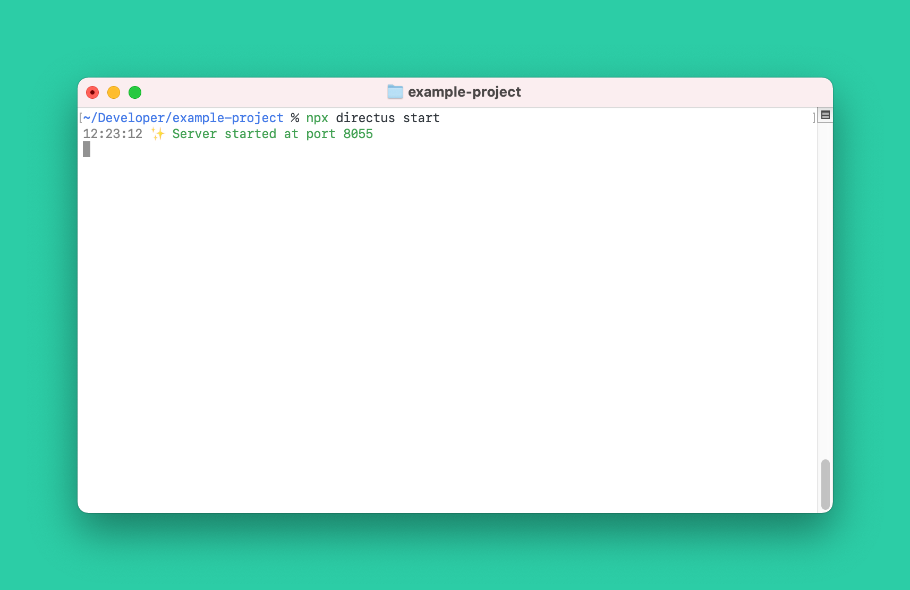
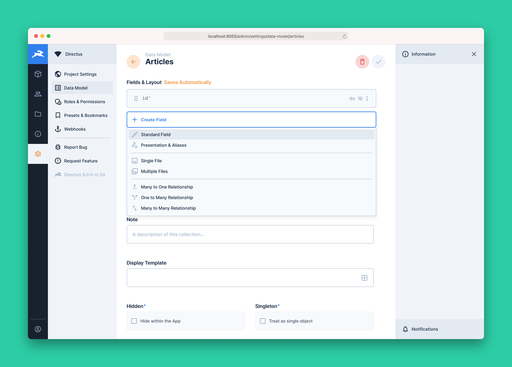
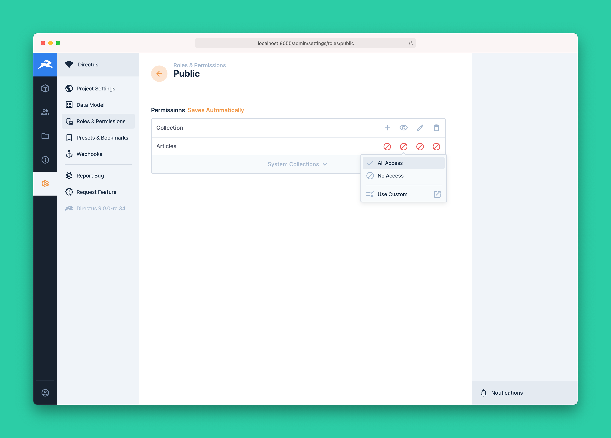

# Quickstart Guide

> If you're looking for the fastest way to get up-and-running with Directus, this guide will walk you through getting
> things installed, configured, and modeled.

## 1. Installation

Make sure you have the latest LTS version or newer of [Node.js](https://nodejs.dev) installed, and have a running
database ready to connect to.

Run the following command in your terminal and follow the prompts.

```bash
npx create-directus-project example-project
```


Once the installation is complete, you can start Directus by navigating to your project folder (in this case
`example-project`) and running:

```
npx directus start
```



## 2. Login to App

With the server running, you're now able to login to your new Directus project and start using it.

Our start command stated that the server started at port `8055`, which means we can navigate to
[http://localhost:8055](http://localhost:8055) to open Directus in the browser.

Login using the admin credentials you configured during the installation in Step 1.

## 3. Create a Collection

Once logged in, you're greeted with the option to create your first Collection:


Follow the prompts and create a Collection. For the sake of this demo, we'll be calling ours `articles`, but feel free
to make it your own!

::: tip More Info on Collections

For a more in-depth guide to setting up Collections, see [Collections](/guides/collections).

:::

## 4. Create a Field

With the Collection created, it's time to start adding some Fields. Click the **"Create Field"** button, and select
"Standard Field":



We'll be calling our Field `title`. While Directus offers a range of powerful field customization options, we'll be
sticking to the defaults for now. These defaults use the "String" datatype and "Text Input" interface

::: tip More Info on Fields

To learn more about the different types of Fields, and all available options, see [Fields](/guides/fields).

:::

## 5. Create an Item

Now that we have a Collection with a Field configured, it's time to start adding some content. Navigate to the
Collections Module (top left), open your created Collection, and click the "+" button in the top-right to get started.


Once you're happy with your creation, click the checkmark in the top-right to save your item to the database.

::: tip More Info on Items

To learn more about the different types of Items, and all available options, see [Items](/guides/items).

:::

## 6. Set Role/Public Permissions

By default, all content entered into Directus is considered private. This means that no data will be returned by the
API, unless requested by an authenticated user that has the correct permissions. In order to have the API return our
items, we'll have to setup some permissions. Navigate to **Settings Module > Roles & Permissions**.

Directus ships with a special **"Public"** role that controls what data is returned to non-authenticated users. Select
the public role, find your collection, and click the icon under the "eye" icon (read/view permission) to allow the
public role to read the items in your collection.



::: tip More Info on Roles & Permissions

Roles & Permissions are extremely powerful and can get pretty in-depth. To learn all about the nuances in setting up
roles & permissions, see [Roles](/guides/roles) & [Permissions](/guides/permissions).

:::

## 7. Connect to the API

Now that your project has some content in it, it's time to start using this content externally. Data can be accessed in
a number of ways, including the REST API, GraphQL, the CLI, or even straight from the database. In this case, we'll use
[the `/items/` REST API endpoint](/reference/api/rest/items) to retrieve the item we just created.

Using your browser, or an API tool like [Postman](http://postman.com) or [Paw](https://paw.cloud), open
[http://localhost:8055/items/articles](http://localhost:8055/items/articles).

And there it is! The Article Item you just created is being served in beautiful JSON, ready to be used anywhere and
everywhere!

```json
{
	"data": [
		{
			"id": 1,
			"title": "Hello World!"
		}
	]
}
```
