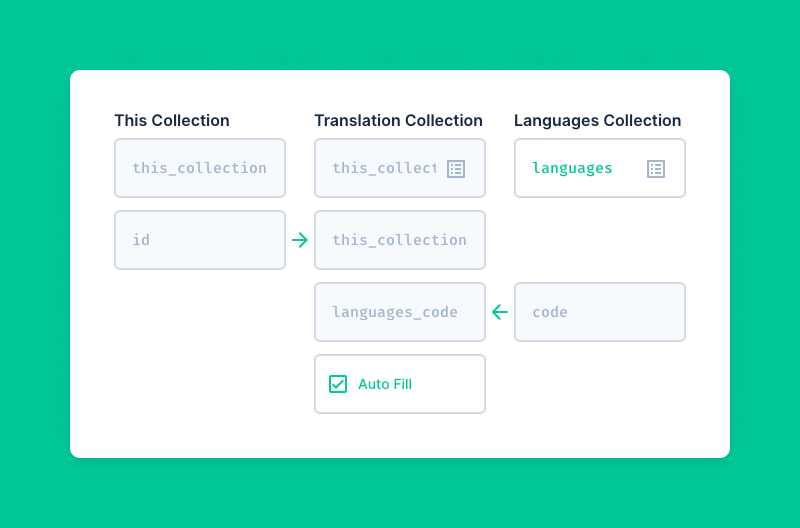

# Fields

> Fields are a specific type of value within a Collection, storing the data of your item's content. Each field
> represents a **column** in your database. [Learn more about Fields](/concepts/fields/).

::: tip System Fields

While all out-of-the-box system fields are locked from editing or deleting, you are able to create new fields within the
system collections. You can enable editing System Collections within the Collection sidebar component of
[Settings > Data Model](/concepts/databases/).

:::

::: tip Database Fields

Keep in mind that a Directus Field is just a database column. Therefore you can import or create a column directly in
the database, and it will automatically appear within Directus. The first time you manage that column, a
`directus_fields` record will be created with default values.

:::

## Creating a Field

1. Navigate to **Settings > Data Model > [Collection Name]**
2. Under Fields & Layout, click the **Create Field** button
3. **Choose the field type**, and follow its specific setup guide. (See below)
   - [Schema Setup](#schema-setup)
   - [Relationship Setup](#relationship-setup)
   - [Field Setup](#field-setup)
   - [Interface Options](#interface-options)
   - [Display Options](#display-options)

### Schema Setup

This pane controls the technical details of the field's database column.

- **Key** — (Required) The database column name and field's API key. The key must be unique within its parent
  Collection. As of now, all keys are sanitized: lowercased, alphanumeric, and with spaces removed. Keys can not be
  changed once created, however you can use [Translations](/concepts/translations/#schema-translations) to override the
  field's display name in the App.
- **Type** — (Required) How the data is saved to the database; See [Directus Data Type Superset](/concepts/types). This
  dropdown maybe be limited or even disabled based on your chosen Field category.
- **Length** — (Only for certain types) For String types this determines the number of characters that can be stored in
  the database. For Float and Decimal types, this control becomes **Precision & Scale**.
- **On Create** — (Only for certain types) For some data types, this option allows you to control what value is saved
  when an item is created. These values are fallbacks and can be overridden by the App/API. For example, the Timestamp
  type allows you to "Save Current Date/Time".
- **On Update** — (Only for certain types) For some data types, this option allows you to control what value is saved
  when an item is updated. These values are fallbacks and can be overridden by the App/API. For example, the UUID type
  allows you to "Save Current User ID".
- **Default Value** — This is the initial value shown for a field when creating an item in the App. If creating an item
  via the API, this is the fallback value saved to the database if a field value is not submitted.
- **Allow NULL** — Toggles if the database column is nullable. When disabled, a `NULL` value can not be saved to the
  field's column.
- **Unique** — Toggles if the database column's values must all be unique.

### Relationship Setup

This pane is only shown when configuring relational fields (including images and translations).

::: tip Matching Existing Schema

To select existing Collections or Fields, use the list icon button on the right-side of the input — exact schema matches
are shown in blue. Collections or Fields without a match will be created on save. For more control over the primary key
field type, first follow the normal [Create a Collection](/guides/collections/#creating-a-collection) flow before
configuring the relationship.

:::

::: tip Corresponding Field

[Relationships go both ways](/concepts/relationships/#perspective-matters), so when creating a new relation Field,
Directus offers to automatically create the corresponding Field on the related Collection.

:::

#### Many-to-One

The [Many-to-One](/concepts/relationships/#many-to-one-m2o) is the only Relationship type that creates/uses an actual
field on the parent Collection. If the chosen Related Collection already exists, the primary key field is automatically
selected. If the Related Collection does not already exist, you will be prompted to enter the name of its new primary
key field.

#### One-to-Many

The [One-to-Many](/concepts/relationships/#one-to-many-o2m) creates an [Alias](/concepts/fields/#fields) field on the
parent Collection. To configure, enter or select a Related Collection and a field therein for storing the foreign key.
The related field must have a data type that matches the type of "This" Collection's primary key field.

The optional **Sort Field** can be used enable the reordering of items within the O2M field. Configured by entering the
name/key of a Field (numeric type only) from the Related Collection.

#### Many-to-Many

The [Many-to-Many](/concepts/relationships/#many-to-many-m2m) creates an [Alias](/concepts/fields/#fields) field on the
parent Collection. To configure, enter or select a Related Collection and a field therein for storing the foreign key.

To configure the Junction Collection, you can leave "Auto Fill" enabled to let Directus generate intelligent defaults,
or disable it to select existing options or enter custom naming.

#### Many-to-Any

The [Many-to-Any](/concepts/relationships/#many-to-any-m2a) creates an [Alias](/concepts/fields/#fields) field on the
parent Collection. To configure, select one or more Related Collections. The primary key field of each will
automatically be referenced.

To configure the Junction Collection, you can leave "Auto Fill" enabled to let Directus generate intelligent defaults,
or disable it to select existing options or enter custom naming.

#### Translations

[Translations](/concepts/translations/#content-translations) creates an [Alias](/concepts/fields/#fields) field on the
parent Collection. The easiest way to create this is to use the modal wizard, which only asks for the Translation field
name:

If you choose to switch to the **manual editor**, enter or select a Related Collection and a field therein for storing
the foreign key.

To configure the Translations Collection, you can leave "Auto Fill" enabled to let Directus generate intelligent
defaults, or disable it to select existing options or enter custom naming.

### Field Setup

- **Required** — Toggles if a value for the Field is required.
  - Empty strings (`''`) and `NULL` are **not** accepted as a valid value
  - `0` and `false` are accepted as a valid value
  - Default values are accepted as a valid value
  - Permission Presets are accepted as a valid value
- **Readonly** — (App Only) Sets the field to be disabled.
- **Hidden** — (App Only) Hides the field in the App form.
  - The field is still available in filters and Layout options.
- **Note** — (App Only) Displayed below the field in the App form, providing a helpful comment for App users. This note
  supports markdown.
- **Field Name Translations** — (App Only) A repeater for translating the Field Name into different locales. It can also
  be used to "rename" the field in the primary language without updating the field Key.

### Interface Options

This pane includes any customization options that may be defined by the Interface.

### Display Options

This pane includes any customization options that may be defined by the Display.

## Updating a Field

1. Navigate to **Settings > Data Model > [Collection Name]**
2. Click the field you want to update
3. Follow the specific setup guide for the field type...

::: tip

Learn more about the field options for [Adjusting the Field Layout](#adjusting-field-arrangement).

:::

## Renaming a Field

While you can not change the **Key** of a field via Directus (as of now), you can change its **Name** and translations.

1. Navigate to **Settings > Data Model > [Collection Name]**
2. **Click the Field** you want to update
3. Navigate to the **Field Tab**
4. Click the Add New button under **Field Name Translations**
5. Choose the desired **Language** (your primary language for "renaming")
6. Enter a **Translation**
7. Click the **Save** button

::: tip Special Casing

If you are trying to update the specific casing (uppercase/lowercase) for a word (eg: `Dna` to `DNA`) you will want to
add the edge-case to the
[Format Title package](https://github.com/directus/directus/tree/main/packages/format-title/src). If you feel the case
passes our [80/20 rule](https://docs.directus.io/contributing/introduction/#feature-requests) you should submit a Pull
Request to the codebase, otherwise you can update this in your instance.

:::

## Duplicating a Field

1. Navigate to **Settings > Data Model > [Collection Name]**
2. Click the **More Options** icon for the field you want to delete
3. Click the **Duplicate Field** option

::: warning Relational and Primary Key Fields

It is not currently possible to duplicate relational fields or a collection's primary key.

:::

## Adjusting Field Arrangement

The form design of the collection's fields is determined by the following options.

- **Field Visibility** — If the field is "Visible" or "Hidden"
- **Field Width** — How wide the field is shown relative to the form/page
  - Half — The field is shown at half the form width
  - Full — (Default) The field is shown at the full form width
  - Fill — The field is shown filling the page width
- **Field Sort** — The order of fields within the form
- **Field Group** — If the field is a "group" type

<!-- @TODO 1. Create any desired groupings by **[Creating a Field Group](/guides/fields)** -->

2. Click the **More Options** icon for any fields to adjust visibility
3. Click the **More Options** icon for any fields to adjust width
4. **Rearrange fields and groups** with their drag-and-drop handles

## Deleting a Field

1. Navigate to **Settings > Data Model > [Collection Name]**
2. Click the **More Options** icon for the field you want to delete
3. Click the **Delete Field** option
4. Confirm this decision by clicking **Delete** in the dialog

::: danger Irreversible Change

This action is permanent and can not be undone. Please proceed with caution.

:::
