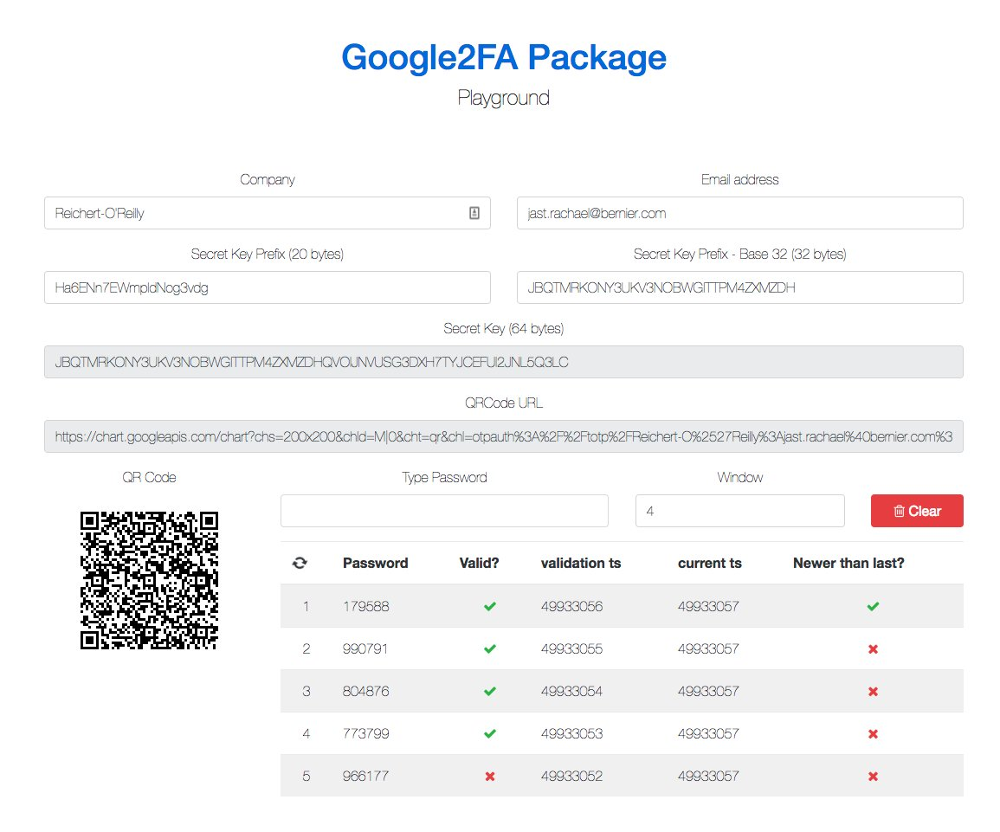

<p style="font-color: red;">
    Google API for QR generator is turned off. 
</p>

All version of that package prior to 5.0.0 are deprecated. Please, make composer update and check documentation regarding [QRCode generation](https://github.com/antonioribeiro/google2fa#generating-qrcodes).

# Google2FA

<p align="center">
    <a href="https://packagist.org/packages/pragmarx/google2fa"></a>
    <a href="LICENSE.md"></a>
    <a href="https://scrutinizer-ci.com/g/antonioribeiro/google2fa/?branch=master"></a>
    <a href="https://travis-ci.org/antonioribeiro/google2fa"></a>
</p>
<p align="center">
    <a href="https://packagist.org/packages/pragmarx/google2fa"></a>
    <a href="https://scrutinizer-ci.com/g/antonioribeiro/google2fa/?branch=master"></a>
    <a href="https://styleci.io/repos/24296182"></a>
    <a href="https://travis-ci.org/antonioribeiro/google2fa"></a>
</p>

### Google Two-Factor Authentication for PHP Package

Google2FA is a PHP implementation of the Google Two-Factor Authentication Module, supporting the HMAC-Based One-time Password (HOTP) algorithm specified in [RFC 4226](https://tools.ietf.org/html/rfc4226) and the Time-based One-time Password (TOTP) algorithm specified in [RFC 6238](https://tools.ietf.org/html/rfc6238).

This package is agnostic, but there's a [Laravel bridge](https://github.com/antonioribeiro/google2fa-laravel).

## Demos, Example & Playground

Please check the [Google2FA Package Playground](http://pragmarx.com/playground/google2fa). 



Here's an demo app showing how to use Google2FA: [google2fa-example](https://github.com/antonioribeiro/google2fa-example).

You can scan the QR code on [this (old) demo page](https://antoniocarlosribeiro.com/technology/google2fa) with a Google Authenticator app and view the code changing (almost) in real time.

## Requirements

- PHP 5.4+

## Installing

Use Composer to install it:

    composer require pragmarx/google2fa

To generate inline QRCodes, you'll need to install a QR code generator, e.g. [BaconQrCode](https://github.com/Bacon/BaconQrCode):
  
    composer require bacon/bacon-qr-code

## Using It

### Instantiate it directly

```php
use PragmaRX\Google2FA\Google2FA;
    
$google2fa = new Google2FA();
    
return $google2fa->generateSecretKey();
```

## How To Generate And Use Two Factor Authentication

Generate a secret key for your user and save it:

```php
$user->google2fa_secret = $google2fa->generateSecretKey();
```

## Generating QRCodes

The securer way of creating QRCode is to do it yourself or using a library. First you have to install a QR code generator e.g. BaconQrCode, as stated above, then you just have to generate the QR code url using:
 
```php
$qrCodeUrl = $google2fa->getQRCodeUrl(
    $companyName,
    $companyEmail,
    $secretKey
);
```

Once you have the QR code url, you can feed it to your preferred QR code generator.

```php
// Use your own QR Code generator to generate a data URL:
google2fa_url = custom_generate_qrcode_url($qrCodeUrl);

/// and in your view:


```

And to verify, you just have to:

```php
$secret = $request->input('secret');

$valid = $google2fa->verifyKey($user->google2fa_secret, $secret);
```

## QR Code Packages  

This package suggests the use of [Bacon/QRCode](https://github.com/Bacon/BaconQrCode) because it is known as a good QR Code package, but you can use it with any other package, for instance [Simple QrCode](https://www.simplesoftware.io/docs/simple-qrcode) or [Endroid QR Code](https://github.com/endroid/qr-code), which both use [Bacon/QRCode](https://github.com/Bacon/BaconQrCode) to produce QR Codes.

Usually you'll need a 2FA URL, so you just have to use the URL generator:

```php
$google2fa->getQRCodeUrl($companyName, $companyEmail, $secretKey)
```

#### Here's an example using Simple QrCode:

```php
<div class="visible-print text-center">
    {!! QrCode::size(100)->generate($google2fa->getQRCodeUrl($companyName, $companyEmail, $secretKey)); !!}
    <p>Scan me to return to the original page.</p>
</div>
```

#### Endroid QR Code Generator

Generate the data URL

```php

$qrCode = new \Endroid\QrCode\QrCode($value);
$qrCode->setSize(100);
$google2fa_url = $qrCode->writeDataUri();
```
   
And in your view

```php
<div class="visible-print text-center">
    {!! $google2fa_url !!}
    <p>Scan me to return to the original page.</p>
</div>
```

#### BaconQRCode directly

```php
<?php

use PragmaRX\Google2FA\Google2FA;
use BaconQrCode\Renderer\ImageRenderer;
use BaconQrCode\Renderer\Image\ImagickImageBackEnd;
use BaconQrCode\Renderer\RendererStyle\RendererStyle;
use BaconQrCode\Writer;

$google2fa = app(Google2FA::class);

$g2faUrl = $google2fa->getQRCodeUrl(
    'pragmarx',
    'google2fa@pragmarx.com',
    $google2fa->generateSecretKey()
);

$writer = new Writer(
    new ImageRenderer(
        new RendererStyle(400),
        new ImagickImageBackEnd()
    )
);

$qrcode_image = base64_encode($writer->writeString($g2faUrl));
```

And show it as an image:

```php
 "/>
```

## Server Time

It's really important that you keep your server time in sync with some NTP server, on Ubuntu you can add this to the crontab:

```bash
sudo service ntp stop
sudo ntpd -gq
sudo service ntp start
```

## Validation Window

To avoid problems with clocks that are slightly out of sync, we do not check against the current key only but also consider `$window` keys each from the past and future. You can pass `$window` as optional third parameter to `verifyKey`, it defaults to `4`. A new key is generated every 30 seconds, so this window includes keys from the previous two and next two minutes.

```php
$secret = $request->input('secret');

$window = 8; // 8 keys (respectively 4 minutes) past and future

$valid = $google2fa->verifyKey($user->google2fa_secret, $secret, $window);
```

An attacker might be able to watch the user entering his credentials and one time key.
Without further precautions, the key remains valid until it is no longer within the window of the server time. In order to prevent usage of a one time key that has already been used, you can utilize the `verifyKeyNewer` function.

```php
$secret = $request->input('secret');

$timestamp = $google2fa->verifyKeyNewer($user->google2fa_secret, $secret, $user->google2fa_ts);

if ($timestamp !== false) {
    $user->update(['google2fa_ts' => $timestamp]);
    // successful
} else {
    // failed
}
```

Note that `$timestamp` either `false` (if the key is invalid or has been used before) or the provided key's unix timestamp divided by the key regeneration period of 30 seconds.

## Using a Bigger and Prefixing the Secret Key

Although the probability of collision of a 16 bytes (128 bits) random string is very low, you can harden it by:
 
#### Use a bigger key

```php
$secretKey = $google2fa->generateSecretKey(32); // defaults to 16 bytes
```

#### You can prefix your secret keys

You may prefix your secret keys, but you have to understand that, as your secret key must have length in power of 2, your prefix will have to have a complementary size. So if your key is 16 bytes long, if you add a prefix it must be also 16 bytes long, but as your prefixes will be converted to base 32, the max length of your prefix is 10 bytes. So, those are the sizes you can use in your prefixes:

```
1, 2, 5, 10, 20, 40, 80...
```

And it can be used like so:

```php
$prefix = strpad($userId, 10, 'X');

$secretKey = $google2fa->generateSecretKey(16, $prefix);
```

#### Window

The Window property defines how long a OTP will work, or how many cycles it will last. A key has a 30 seconds cycle, setting the window to 0 will make the key lasts for those 30 seconds, setting it to 2 will make it last for 120 seconds. This is how you set the window:

```php
$secretKey = $google2fa->setWindow(4);
```

But you can also set the window while checking the key. If you need to set a window of 4 during key verification, this is how you do: 

```php
$isValid = $google2fa->verifyKey($seed, $key, 4);
```

#### Key Regeneration Interval

You can change key regeneration interval, which defaults to 30 seconds, but remember that this is a default value on most authentication apps, like Google Authenticator, which will, basically, make your app out of sync with them.

```php
$google2fa->setKeyRegeneration(40);
```

## Google Authenticator secret key compatibility

To be compatible with Google Authenticator, your (converted to base 32) secret key length must be at least 8 chars and be a power of 2: 8, 16, 32, 64...
  
So, to prevent errors, you can do something like this while generating it:
  
```php
$secretKey = '123456789';
  
$secretKey = str_pad($secretKey, pow(2,ceil(log(strlen($secretKey),2))), 'X');
```

And it will generate

```
123456789XXXXXXX
```

By default, this package will enforce compatibility, but, if Google Authenticator is not a target, you can disable it by doing  

```php
$google2fa->setEnforceGoogleAuthenticatorCompatibility(false);
```

## Google Authenticator Apps:

To use the two factor authentication, your user will have to install a Google Authenticator compatible app, those are some of the currently available:

* [Authy for iOS, Android, Chrome, OS X](https://www.authy.com/)
* [FreeOTP for iOS, Android and Pebble](https://apps.getpebble.com/en_US/application/52f1a4c3c4117252f9000bb8)
* [Google Authenticator for iOS](https://itunes.apple.com/us/app/google-authenticator/id388497605?mt=8)
* [Google Authenticator for Android](https://play.google.com/store/apps/details?id=com.google.android.apps.authenticator2)
* [Google Authenticator (port) on Windows Store](https://www.microsoft.com/en-us/store/p/google-authenticator/9wzdncrdnkrf)
* [Microsoft Authenticator for Windows Phone](https://www.microsoft.com/en-us/store/apps/authenticator/9wzdncrfj3rj)
* [LastPass Authenticator for iOS, Android, OS X, Windows](https://lastpass.com/auth/)
* [1Password for iOS, Android, OS X, Windows](https://1password.com)

## Tests

The package tests were written with [phpspec](http://www.phpspec.net/en/latest/).

## Authors

- [Antonio Carlos Ribeiro](http://twitter.com/iantonioribeiro)
- [Phil (Orginal author of this class)](https://www.idontplaydarts.com/static/ga.php_.txt)
- [All Contributors](https://github.com/antonioribeiro/google2fa/graphs/contributors)

## License

Google2FA is licensed under the MIT License - see the [LICENSE](LICENSE.md) file for details.

## Contributing

Pull requests and issues are more than welcome.
